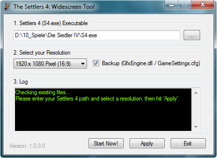
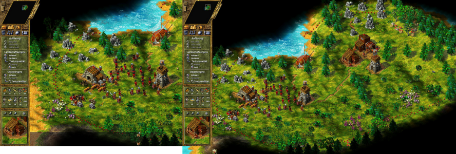

#  The Settlers 4: Widescreen Tool
#### Veni vidi vici - Gaius Iulius Caesar

## Introduction

This Tool allows you to play **The Settlers 4** in resolutions up to Full HD.

### Supported resolutions

- Default Resolution
- 1024 x 600 Pixel (17:10)
- 1280 x 720 Pixel (16:9)
- 1280 x 800 Pixel (16:10)
- 1366 x 768 Pixel (16:9)
- 1440 x 900 Pixel (16:10)
- 1680 x 1050 Pixel (16:10)
- 1920 x 1080 Pixel (16:9)
- 1920 x 1200 Pixel (16:10)

## Preview image

## In-game compare (1280x1024 <> 1920x1080)

## How to use

Just run the **[The Settlers 4 - Widescreen Tool.exe](https://github.com/FireEmerald/Settlers4-Widescreen-Tool/raw/master/pre-compiled/The%20Settlers%204%20-%20Widescreen%20Tool.exe)**. No installation required.

## FAQ / READ ME

The Tool was tested under Windows 7 and The Settlers 4 - Gold Edition (**v2.50.1508**).

- Q: If you fight as mayan the music stops to play after a fight.
> A: This is a known bug, it was never fixed. You can start the music again, if you move ingame the **Sound FX** slider under *Settings* > *Sound settings*.

- Q: The Game doesn't start in a virtual machine. (*Software/Hardware 3D : Error initializing Graphic Interface !*)
> A: There are a couple of threads where people write about this problem, but none of them found a way to start the game... me too.

- Q: *Fatal error: Exception 0xc0000005 at 0x00468bd0!*
> A: Occures if something went wrong while using trading routes via ship (but not limited to this). It's a bug from the game itself.

## Requirements

- Platform: Windows (32/64bit)
- Supported: Windows 2000 until Windows 7. You may get errors from the game itself under Windows 8 and newer!
- .NET Framework ≥ 3.5
- Microsoft Visual Studio ≥ 2013

## Reporting issues

Use the Github [Issuetracker](https://github.com/FireEmerald/Settlers4-Widescreen-Tool/issues) to report a bug.

## Submitting fixes

Fixes are submitted as [pull request](https://github.com/FireEmerald/Settlers4-Widescreen-Tool/pulls) via Github or as code in a issue.

## Copyright

Copyright (C) 2015-2016 by [FireEmerald](https://github.com/FireEmerald)

License: [GPL 3.0](LICENSE)
